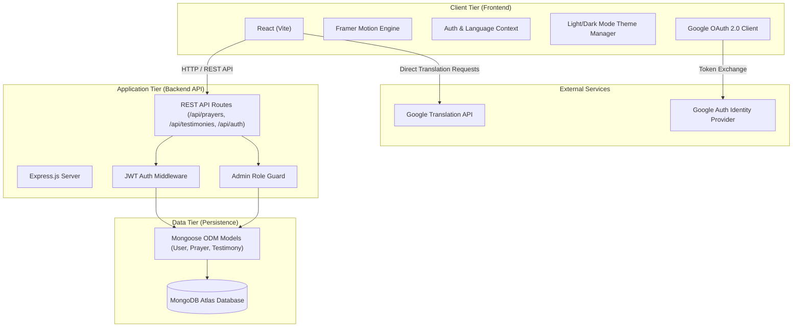
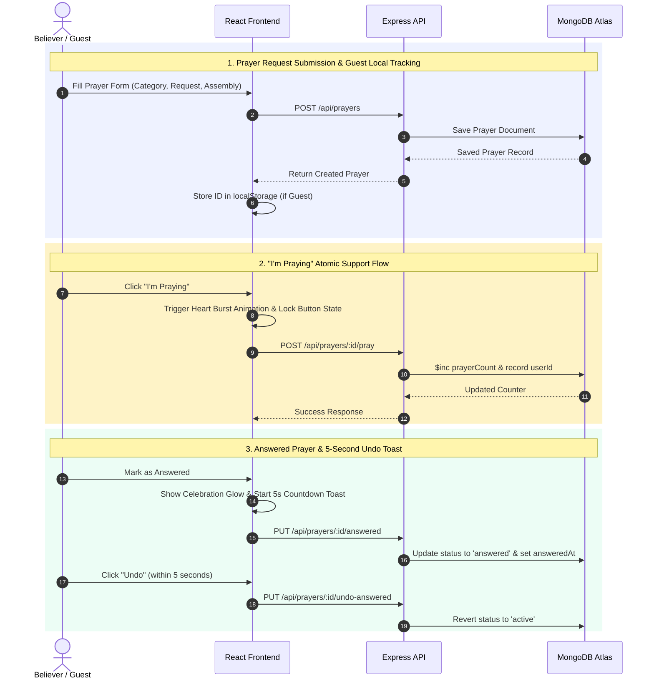

# 🙏 Prayer Wall — Sacred Stillness

A vibrant, mobile-first web application where believers across churches and assemblies unite in communal prayer, submit prayer requests, track prayer participation, celebrate answered prayers through shared testimonies, and manage community moderation.

---

## 🏗️ System Architecture

The application is built using a decoupled **Client-Server-Database Architecture** tailored for high performance, mobile responsiveness, and fluid real-time interactions.



---

## 🔄 Core Data Flow & System Design



---

## 📂 Project Structure

```text
Prayer-Wall/
├── backend/                        # Node.js + Express + MongoDB Backend Server
│   ├── src/
│   │   ├── config/
│   │   │   └── db.js               # MongoDB Atlas Mongoose connection setup
│   │   ├── middleware/
│   │   │   ├── auth.js             # JWT authentication & guest request validation
│   │   │   └── admin.js            # Admin role authorization guard
│   │   ├── models/
│   │   │   ├── User.js             # User account schema (Auth, Google ID, Admin flag)
│   │   │   ├── Prayer.js           # Prayer request schema (Category, Assembly, Count, Status)
│   │   │   └── Testimony.js        # Answered prayer testimony schema (Approval status)
│   │   ├── routes/
│   │   │   ├── auth.js             # Sign in, register, Google OAuth, password endpoints
│   │   │   ├── prayers.js          # Prayer CRUD, "I'm Praying", Mark Answered endpoints
│   │   │   ├── testimonies.js     # Public testimonies & submission endpoints
│   │   │   └── admin.js            # Admin stats, testimony approval & moderation routes
│   │   ├── utils/
│   │   │   └── seeder.js           # Database initialization & default categories
│   │   └── server.js               # Express application entry point
│   ├── .env.example                # Backend environment variable template
│   └── package.json                # Node backend dependencies
│
├── frontend/                       # React + Vite + Framer Motion Frontend App
│   ├── public/                     # Static assets & favicon
│   ├── src/
│   │   ├── components/             # Reusable UI presentation components
│   │   │   ├── BottomNav.jsx       # Sliding indicator bottom navigation bar
│   │   │   ├── ConfirmModal.jsx    # Glassmorphic celebratory confirmation modal
│   │   │   ├── PrayerCard.jsx      # Prayer card with category colors & heart burst
│   │   │   ├── SearchOverlay.jsx   # Animated full-screen search modal
│   │   │   ├── SkeletonLoader.jsx  # Pulse skeleton loaders for loading states
│   │   │   ├── TestimonyCard.jsx   # Celebratory gold testimony card
│   │   │   ├── TopHeader.jsx       # Header with Theme (Dark/Light) & Language toggles
│   │   │   └── UndoToast.jsx       # Toast with 5-second countdown progress bar
│   │   ├── context/
│   │   │   ├── AuthContext.jsx     # User authentication, token & guest session provider
│   │   │   └── LanguageContext.jsx # English / Telugu translation dictionary provider
│   │   ├── pages/                  # Route views
│   │   │   ├── AdminDashboard.jsx  # Admin stats count-up & testimony moderation feed
│   │   │   ├── CelebratePage.jsx   # Sacred Stories testimony celebration feed
│   │   │   ├── ChangePasswordPage.jsx # User security & password reset view
│   │   │   ├── LoginPage.jsx       # Auth view with Google Login & tab switcher
│   │   │   ├── MyPrayersPage.jsx   # User active/answered prayer management
│   │   │   ├── OnboardingPage.jsx  # Church assembly onboarding configuration
│   │   │   ├── PostPrayerPage.jsx  # Prayer request submission with category picker
│   │   │   ├── PrayerWallPage.jsx  # Main Prayer Wall feed with sort & filter chips
│   │   │   └── SplashScreen.jsx    # Animated sunrise splash screen with verse
│   │   ├── api.js                  # Axios/Fetch API client wrapper for backend routes
│   │   ├── App.jsx                 # Main React router container with Framer Motion transitions
│   │   ├── index.css               # Design system, CSS tokens, dark mode & mesh gradients
│   │   └── main.jsx                # React application entry point
│   ├── index.html                  # HTML template with Google Fonts imports
│   ├── vite.config.js              # Vite build tool setup & Tailwind CSS v4 plugin
│   └── package.json                # Frontend React dependencies
│
└── README.md                       # Comprehensive documentation
```

---

## ⚙️ Key Technical Specifications

| Layer | Technologies & Design Decisions |
| :--- | :--- |
| **Frontend Framework** | React 19, Vite 6 |
| **Styling & Theme** | Tailwind CSS v4, Vanilla CSS Design System, Glassmorphic UI, Dark/Light Mode, Sunset Mesh Gradients |
| **Animations** | Framer Motion (Page route transitions, sliding tab pills, heart burst particles, countdown toast) |
| **State & Auth** | React Context API, Google OAuth 2.0 (`@react-oauth/google`), JWT Bearer Tokens, LocalStorage persistence for Guests |
| **Backend API** | Node.js, Express.js REST API, CORS security, JWT Auth Middleware |
| **Database** | MongoDB Atlas, Mongoose ODM Schema validation, Atomic updates (`$inc`, `$addToSet`) |
| **Multi-Language** | Dynamic English / Telugu dictionary crossfade, Google Translate Client Bridge for requests |
